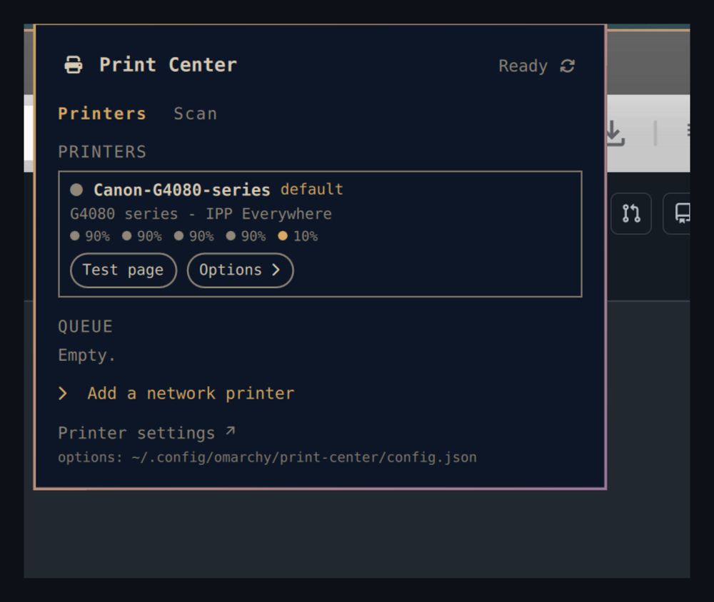

# Print Center

An [Omarchy](https://omarchy.org) shell plugin to manage CUPS printers and the
print queue from the bar.

Omarchy already installs and enables CUPS, `cups-browsed`, and Avahi, so
driverless network printers appear on their own — but the only interface is a
hidden GTK dialog. Print Center puts a small pill in the bar and a popup behind
it.



## What it does

**Bar pill** — the tracked printer's state and the number of queued jobs. It
turns your theme accent on a warning (paper low, ink low, paused) and urgent on
an error (out of paper, jam, offline) or when the CUPS service is down.

**Popup**

- **Printers** — each configured printer with its state, the default marker,
  make and model, and ink / supply levels. Per printer: **Set default**
  (per-user, no password) and **Test page**.
- **Queue** — every active job with **Hold / Release** and **Cancel**, plus
  **Clear the whole queue** when there is more than one.
- **Add a network printer** — scans the network with `driverless` and
  `avahi-browse` and adds the one you pick as a driverless IPP Everywhere
  queue. This is the *only* action that asks for a password (it runs
  `pkexec lpadmin`).
- **Printer settings** — opens `system-config-printer` for anything deeper
  (vendor PPDs, authentication, sharing).

**Notifications** — a headless service polls the queue and notifies you when a
job finishes, a job is held (needs a password, filter failed), or a printer
reports an error. The three event classes — `done`, `error`, `held` — are
toggled independently.

## Requirements

- Node.js — `omarchy pkg add nodejs`. The popup tells you if it is missing.
- Everything else ships with Omarchy: `lpstat`, `lp`, `lpoptions`, `lpadmin`,
  `lpinfo`, `driverless`, `avahi-browse`, `pkexec`, `system-config-printer`.

No scanning yet — SANE support is planned for a later release.

## Install

From the Omarchy plugins menu, or manually:

```bash
git clone https://github.com/dreed47/omarchy-print-center \
  ~/.config/omarchy/plugins/print-center
omarchy restart shell
```

Then add **Print Center** to the bar from the shell's widget menu.

## Settings

Set from the widget's entry in `shell.json`, or in
`~/.config/omarchy/print-center/config.json`:

| key | default | meaning |
|---|---|---|
| `pollSeconds` | `20` | queue check interval (minimum 5) |
| `notify` | `on` | desktop notifications on/off |
| `notifyTypes` | `done,error,held` | which events notify, or `all` |
| `notifyTimeoutSeconds` | `0` | auto-dismiss after N seconds (0 = daemon default) |
| `trackedPrinter` | `""` | printer the pill follows (blank = system default) |
| `showJobCount` | `on` | show the queued-job count in the pill |
| `openOnClick` | `off` | clicking an error notification opens printer settings |
| `debug` | `off` | log raw CLI output to the shell log |

## How it works

All CUPS access lives in one Node CLI, `bin/print-center`. The bar widget
(`BarWidget.qml` + `Panel.qml`) and the headless `Service.qml` both shell out
to it — nothing talks to CUPS directly from QML. Parsing is pure and
unit-tested (`npm test`); system calls are isolated in `lib/io.mjs`.

```
print-center status   --json     overview the pill/popup render from
print-center printers  --json     configured printers + ink levels
print-center jobs      --json [--completed] [--printer NAME]
print-center cancel    <job-id | --all [--printer NAME]>
print-center hold|release|reprint <job-id>
print-center default   <printer>          per-user default (unprivileged)
print-center testpage  <printer>
print-center discover  --json             network printers to add
print-center add       --uri <ipp://…> --name <queue> [--location L]
print-center open-settings
```

Only `add` elevates (`pkexec lpadmin -m everywhere`). Everything else runs as
you: `cancel`/`hold`/`release` act on your own jobs, `default` writes
`~/.cups/lpoptions`.

## License

MIT
